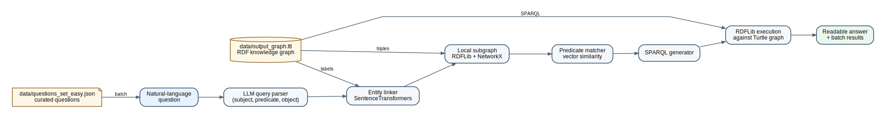

# Knowledge Graph QA Pipeline

Natural-language question answering over an RDF knowledge graph. The project converts a user question into a structured graph query, links the known entity to the graph, extracts a local subgraph, generates SPARQL, and returns readable answers.

This repo is packaged as a portfolio-friendly version of an end-to-end GraphRAG-style prototype. The notebook shows the research workflow; the `src/` package and `scripts/` directory provide a cleaner local Python path.

## What This Demonstrates

- LLM-based query parsing into subject-predicate-object form.
- RDF graph processing with RDFLib and SPARQL.
- Entity linking with SentenceTransformers embeddings.
- Local subgraph extraction with NetworkX.
- Predicate matching using vector similarity.
- Batch evaluation workflow for a curated question set.

## Architecture



The diagram source is maintained in [docs/architecture.dot](docs/architecture.dot) and rendered with Graphviz.

## Repository Layout

```text
.
├── data/                         # RDF graph and question assets
├── notebooks/                    # Polished walkthrough notebook
├── results/                      # Generated batch outputs and subgraphs
├── scripts/                      # Local CLI runners
└── src/kg_query_pipeline/        # Reusable pipeline package
```

## Quickstart

```bash
python -m venv .venv
source .venv/bin/activate
python -m pip install -r requirements.txt
cp .env.example .env
```

Edit `.env` and set `OPENAI_API_KEY`. Place the Turtle graph at `data/output_graph.ttl`, then run:

```bash
python scripts/run_query.py \
  --graph data/output_graph.ttl \
  --question "Who directed The Family Man?"
```

For the curated batch:

```bash
python scripts/run_batch.py \
  --graph data/output_graph.ttl \
  --questions data/questions_set_easy.json \
  --output results/batch_results.csv
```

## Notebook

Open [notebooks/end_to_end_kg_qa_demo.ipynb](notebooks/end_to_end_kg_qa_demo.ipynb) for the full walkthrough. The notebook is intended to explain the pipeline stages and show representative outputs; the reusable implementation lives in `src/kg_query_pipeline`.

## Data

The curated 12-question set is included at `data/questions_set_easy.json`. The original full graph asset should be published as `data/output_graph.ttl` if licensing allows it. This workspace did not contain the TTL graph file at packaging time, so the CLI runners expect that file to be added before execution.

## Results

The notebook run completed 12/12 questions without runtime errors. That is not the same as answer accuracy. For recruiter-facing claims, use `results/batch_results.csv` plus a manual verdict column after reviewing the generated answers against ground truth.

## Known Limitations

- The graph namespace assumptions are currently `http://example.org/resource/` and `http://example.org/predicate/`.
- LLM parsing requires `OPENAI_API_KEY`.
- Entity and predicate matching use semantic similarity, so close-but-wrong matches need manual evaluation.
- Some original notebook outputs were Colab-specific and have been separated from the local package workflow.
